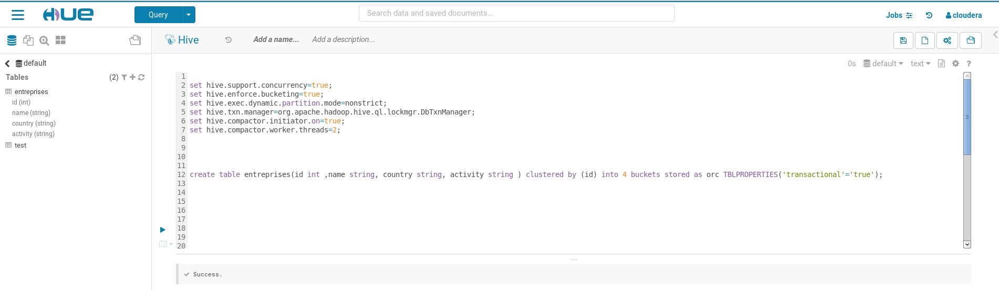
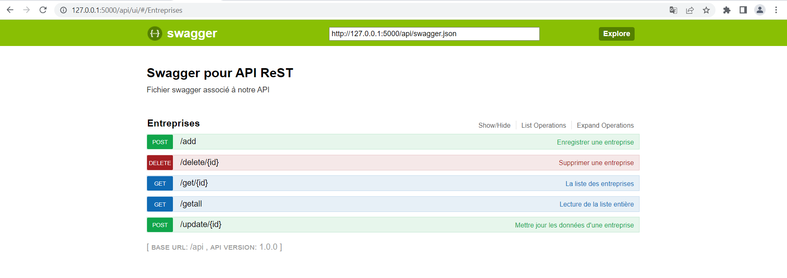

# Projet API REST Hadoop Hive

Ce projet est réalisé en python (Flask) avec comme database Hive.

Swagger est utilisé pour la documentation de cette API.

## Configurations

Ouvrir un terminal 

Ecrire : sudo gedit /etc/hive/conf/hive-site.xml

Cette commande permet d'ouvrir le fichier hive-site.xml en tant qu'administrateur

Dans ce fichier, ajoutez les propriétés ci-dessous

```

 <property>
  <name>hive.support.concurrency</name>
  <value>true</value>
 </property>
 <property>
  <name>hive.enforce.bucketing</name>
  <value>true</value>
 </property>
 <property>
  <name>hive.exec.dynamic.partition.mode</name>
  <value>nonstrict</value>
 </property>
 <property>
  <name>hive.txn.manager</name>
  <value>org.apache.hadoop.hive.ql.lockmgr.DbTxnManager</value>
 </property>
 <property>
  <name>hive.compactor.initiator.on</name>
  <value>true</value>
 </property>
 <property>
  <name>hive.compactor.worker.threads</name>
  <value>2</value>
 </property>
 <property>
  <name>hive.in.test</name>
  <value>true</value>
 </property>
```


Executez les commandes ci-dessous dans Hive:

```
set hive.support.concurrency=true;
set hive.enforce.bucketing=true;
set hive.exec.dynamic.partition.mode=nonstrict;
set hive.txn.manager=org.apache.hadoop.hive.ql.lockmgr.DbTxnManager;
set hive.compactor.initiator.on=true;
set hive.compactor.worker.threads=2;
```



Créer la table entreprises dans la database default

```
create table entreprises(id int ,name string, country string, activity string ) clustered by (id) into 4 buckets stored as orc TBLPROPERTIES('transactional'='true');
```


## Installation du package python Sasl pour Hive

- Ajouter le folder sasl dans le venv de l'application (/Lib/site-packages)

## Gestion des entreprises (CRUD)

Il existe trois grands types de requêtes : POST, GET et DELETE

GET : Affichage d'une seule entreprise à partir de son id et la liste des entreprises

POST : Ajout et modification d'une entreprise

DELETE : Suppression d'une entreprise


